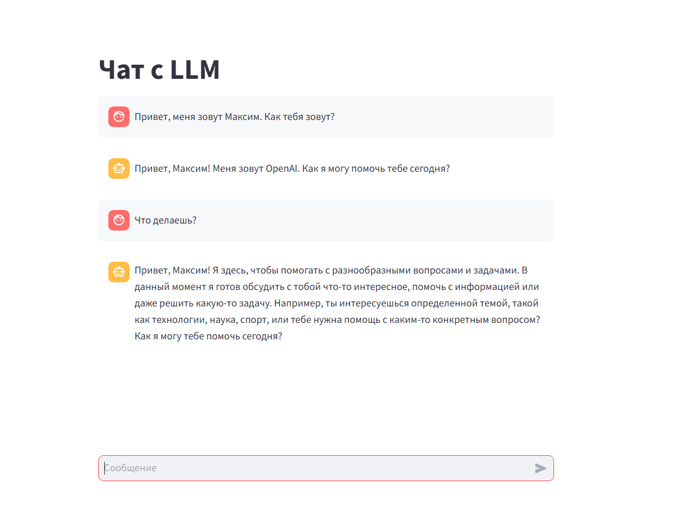

# Чат с LLM

Этот репозиторий содержит простой чат-бот, созданный с использованием языковой модели (LLM). Бот способен отвечать на вопросы и поддерживать базовую беседу, имеет память внутри диалога, а также сохраняет истории диалогов.

---

---

## Технологии

- **UI**: Пользовательский интерфейс сделан на [Streamlit](https://streamlit.io/).
- **LLM**: В качестве языковой модели используется предоставленная API.
- **Интеграция**: Для взаимодействия с LLM используется библиотека [LangChain](https://www.langchain.com/) и [LangGraph](https://www.langchain.com/langgraph).
- **Хранение данных**: История чатов сохраняется в базе данных PostgreSQL.

## Использование приложения
### Предварительные условия

Убедитесь что у Вас установлен и запущен Docker. 

### Запуск

Для запуска склонируйте себе данный репозиторий.

В файле app/.env хранятся параметры для взаимодействия с API LLM.

**В нем необходимо заполнить данные для взаимодействия с API!**

После заполнения данных API войдите в папку app через консоль командой 
~~~ bash
cd app
~~~

Запустите контейнер командой
~~~ bash
docker-compose up --build
~~~

В браузере зайдите по ссылке:
~~~
http://localhost:8501
~~~

